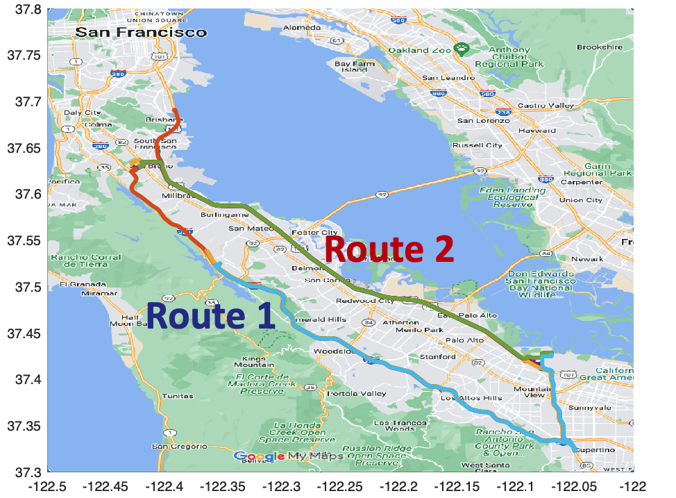

# <em>PrNet</em>: A Neural <em>Net</em>work for Correcting <em>P</em>seudo<em>r</em>anges to Improve Positioning with Android Raw GNSS Measurements
PrNet is a neural network 🤖 for correcting pseudoranges to improve positioning with Android 📱 raw GNSS 🛰️ measurements. This repository includes the preprocessing code, the code of PrNet, and the evaluation data set. 

## Preprocessing Android Raw GNSS Measurements (Coming soon)
The preprocessing code (MATLAB) is based on Google's open-source [gnss measurement tools](https://github.com/google/gps-measurement-tools). Through preprocessing, we extract input features as well as label the training data. Compared to Google's original code, we add more functionalities, including:
* Moving horizon estimation-based positioning
* Extended Kalman filter-based positioning
* Rauch–Tung–Striebel (RTS) smoother-based positioning

👩🏽‍💻 The code is put under PrNet/Preprocessing.
* Set the directory of your Android raw GNSS data file in ProcessGnssMeasScriptPrNet.m, e.g.:
      
      `dirName ='../Data/GSDC2021/Route1/2020-05-29-US-MTV-1'`;
* Specify the name of your Android raw GNSS data file in ProcessGnssMeasScriptPrNet.m, e.g.:

      `prFileName = 'Pixel4_GnssLog.txt'`;
* Specify the name of the ground truth data file, e.g.:

      `gtNmeaFileName = 'SPAN_Pixel4_10Hz.nmea'`;
* Run ProcessGnssMeasScriptPrNet.m to process Android raw GNSS measurements;
* More details can be found in [gnss measurement tools](https://github.com/google/gps-measurement-tools). 

Then, the processed files contain the input features and labels and can be found in the directory you just set. While one of them has a header, the other one only consists of data. For example:

      `SvPVT3D_Error_label_dynamic_2020-05-29-US-MTV-1.csv` with a header
      `SvPVT3D_Error_label_dynamic_data_2020-05-29-US-MTV-1.csv` without headers

## Data Set (Coming soon)
We use the open data set for [Google Smartphone Decimeter Challenge (GSDC) 2021](https://www.kaggle.com/competitions/google-smartphone-decimeter-challenge/overview) to evaluate our method. Most data files were collected in Moutain view. Therefore, the data captured along the following two routes are selected for evaluation:

* 🛣️ Route 1: 🚗 from San Bruno to Mountain View along Interstate 280 (I-280) highway
* 🛣️ Route 2: 🚗 from Brisbane to Mountain View along U.S. Highway 101 

🧑🏼‍💻 The original GSDC 2021 data files are put under:

      `PrNet/Data/GSDC2021/Route1 or Route2`
The preprocessed data files are put under:

      `PrNet/Data/Route1 or Route2` 

## PrNet Implementation (Coming soon)
