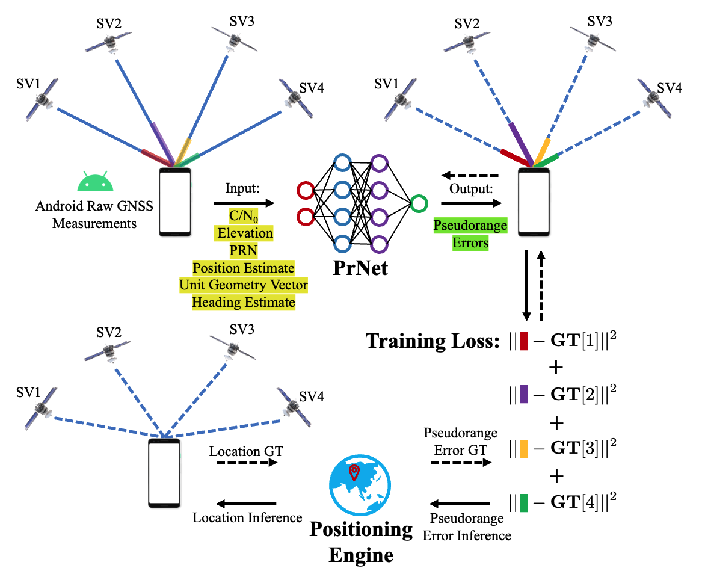
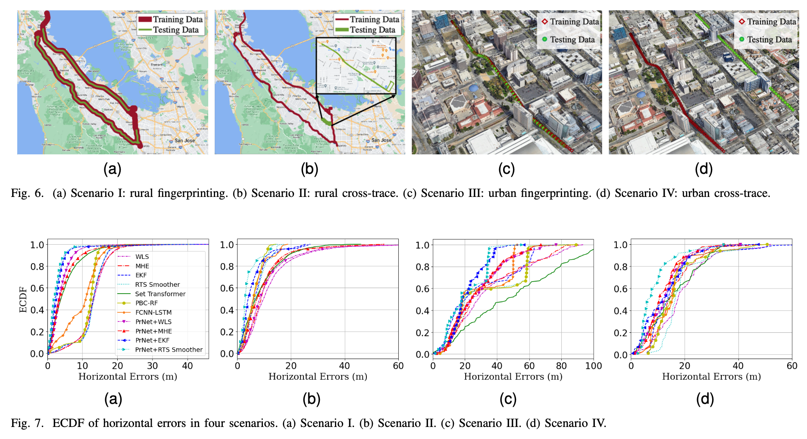
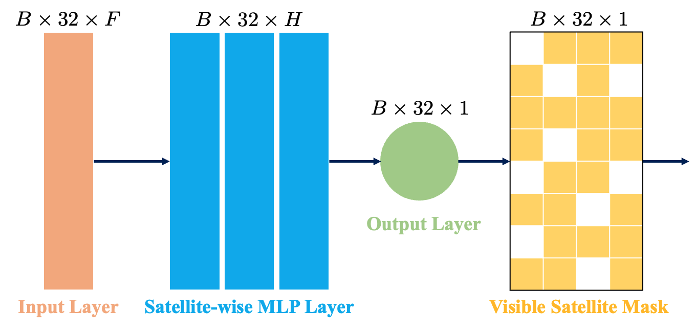

# Project of PrNet
The codes are the implementation of the following paper:

`Weng, X., Ling, K. V., & Liu, H. (2023). PrNet: A neural network for correcting pseudoranges to improve positioning with android raw GNSS measurements. arXiv preprint arXiv:2309.12204.`
<!--- Badge for paper link---> 

## Overview
PrNet is a neural network 🤖 for correcting pseudoranges to improve positioning with Android 📱 raw GNSS 🛰️ measurements. This repository includes the pre-processing/post-processing codes, the codes of PrNet, and the data set. 

## Requirement
Pre-processing and post-processing codes:
* MATLAB
  
PrNet codes:
* Ubuntu 18.04.6 LTS or later 
* Python 3.8.13 or later

## Data (Coming soon)
We use the open data set for [Google Smartphone Decimeter Challenge (GSDC) 2021](https://www.kaggle.com/competitions/google-smartphone-decimeter-challenge/overview) to evaluate our method. We use the dataset to design four scenarios in tow areas, including
* Rural Areas 🚗🛣️
    * Fingerprinting: Interstate 280 (I-280) highway between San Bruno and Mountain View, U.S. Highway 101 between Brisbane and Mountain View
    * Cross-trace: Mountain View City
* Urban Areas 🚗🏬
    * Fingerprinting: Downtown San Jose City
    * Cross-trace: Downtown San Jose City

Our data are put under:

      `PrNet/Data/RouteR or RouteU`

## Pre-processing Android Raw GNSS Measurements (Coming soon)
The pre-processing codes (MATLAB) are used to generate training and testing data from the original [GSDC dataset](https://www.kaggle.com/competitions/google-smartphone-decimeter-challenge/overview). These codes are based on our [androidGnss](https://github.com/AILocAR/androidGnss) repository. 

The codes are put under:

    `PrNet/GNSS_opensource_software`
    
The main entrance for rural fingerprinting positioning is

    `PrNet/GNSS_opensource_software/ProcessGnssMeasScriptGnssNet_Dynamic_PrNet_MTV.m`
    
The main entrance for rural cross-trace, urban fingerprinting, and urban cross-trace positioning is

    `PrNet/GNSS_opensource_software/ProcessGnssMeasScriptGnssNet_Dynamic_PrNet_SJC.m`

Get started (using rural fingerprinting positioning as an example):  
* Step 1: Set the directory of your Android raw GNSS data file in ProcessGnssMeasScriptGnssNet_Dynamic_PrNet_MTV.m, e.g.:
      
      `dirName ='../Data/RouteR/GSDC/2020-05-29-US-MTV-1'`;
* Step 2: Specify the name of your Android raw GNSS data file in ProcessGnssMeasScriptGnssNet_Dynamic_PrNet_MTV.m, e.g.:

      `prFileName = 'Pixel4_GnssLog.txt'`;
* Step 3: Specify the name of the ground truth data file, e.g.:

      `gtNmeaFileName = 'SPAN_Pixel4_10Hz.nmea'`;
* Step 4: Run ProcessGnssMeasScriptPrNet.m to process Android raw GNSS measurements;
* Step 5: The processed files contain the input features and labels and can be found in the directory specified by `dirName`. While one of them has a header, the other one only consists of data. For example:

      `SvPVT3D_Error_label_dynamic_2020-05-29-US-MTV-1.csv` with a header
      `SvPVT3D_Error_label_dynamic_data_2020-05-29-US-MTV-1.csv` without a header

## PrNet Implementation (Coming soon)
PrNet is based on a simple Multilayer perceptron (MLP) structure and implemented using PyTorch and d2l libraries. 

The related code is included under:

      `PrNet/Neural_Pseudorange_Correction`
And the weights we trained are stored in:

      `PrNet/Neural_Pseudorange_Correction/Weights/RouteR or RouteU`

Get started:
* Step 1: Create the `conda` environment, use: 

      `conda env create -f environment.yml`
* Step 2: Open the Jupyter notebook under:

      `PrNet/Neural_Pseudorange_Correction/PrNet_MultipleFile_parallel.ipynb`

* Step 3: Set the directory for training data files, e.g.,

      `training_data_dir = "../Data/RouteR/Training/"`
* Step 4: Config the number of training epochs and learning rate in the cell "Training Process", e.g.,

      `num_epochs, lr = 500, 0.01`
* Step 5: Run the cell "Training Process" to train PrNet. The trained model will be saved under the same root directory, e.g.,

      `PrNet/Neural_Pseudorange_Correction/PrNet_Layer20_H40_heading_500.tar`
* Step 6: Set the directory for the testing data file in the cell "Evaluation Process", e.g.,

      `data_file_eval = "../Data/RouteR/Testing/SvPVT3D_Error_label_dynamic_2020-05-14-US-MTV-1.csv"`
* Step 7: Load the weight file, e.g.,

      `checkpoint = torch.load('PrNet/Neural_Pseudorange_Correction/PrNet_Layer20_H40_heading_500.tar')
       model_eval.load_state_dict(checkpoint['model_state_dict'])`
* Step 8: Run the cell "Evaluation Process" to evaluate PrNet. The predicted pseudorange errors will be logged into a .csv file, e.g.,

      `PrNet/Neural_Pseudorange_Correction/PrM_Bias_2020-05-14-US-MTV-1.csv`

## Post-processing Android Raw GNSS Measurements (Coming soon)
The post-processing codes (MATLAB) are used to calculate locations using Android raw GNSS measurements and the pseudorange errors predicted by PrNet. The codes are generally same as the pre-processing codes.

The codes are put under:

    `PrNet/GNSS_opensource_software`
    
The main entrance for rural fingerprinting positioning is

    `PrNet/GNSS_opensource_software/ProcessGnssMeasScriptGnssNet_Dynamic_PrNet_MTV_test.m`
    
The main entrance for rural cross-trace, urban fingerprinting, and urban cross-trace positioning is

    `PrNet/GNSS_opensource_software/ProcessGnssMeasScriptGnssNet_Dynamic_PrNet_SJC_test.m`

Get started (using rural fingerprinting positioning as an example):
* Step 1: Put the predicted pseudorange error file to the root directory of MATLAB codes, e.g.,

     `PrNet/GNSS_opensource_software/PrM_Bias_2020-05-14-US-MTV-1.csv`
* Step 2: Modify the following line of codes in GpsWlsPvtEKF_test.m:

      `#103 GT_data = load('PrM_Bias_2020-05-14-US-MTV-1.csv');

* Step 3: Run ProcessGnssMeasScriptGnssNet_Dynamic_PrNet_MTV_test.m to get the positioning results.
